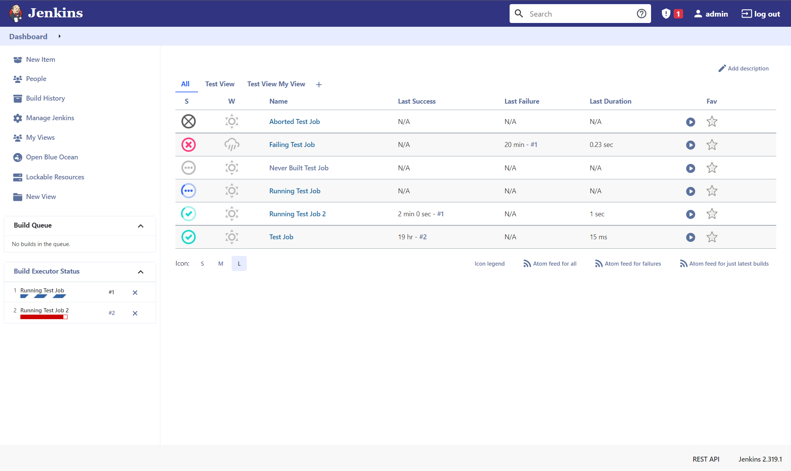
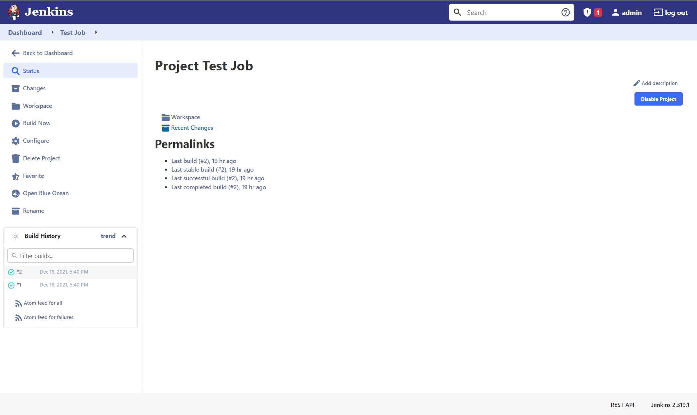
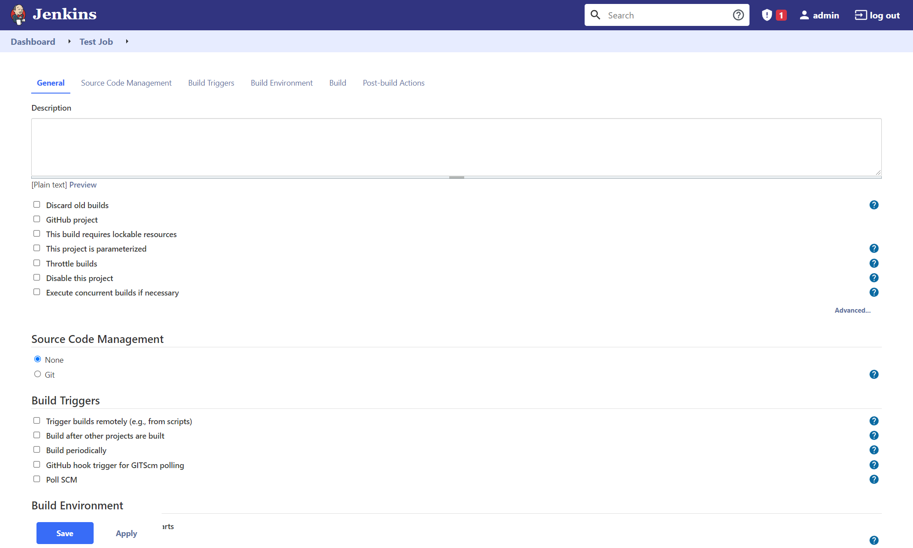

# plabs-jenkins-candy-theme

Transform Jenkins into a more eye-pleasing tool.

## Screenshots

## Installation

1. Install [Jenkins Simple Theme Plugin](https://plugins.jenkins.io/simple-theme-plugin/)
1. Go to `Manage Jenkins` > `Configure System` > `Theme`
1. Choose your prefered option for CSS and JS.
    - You can try the theme by placing the CSS and JS from this repo.
    - If you like to adopt the theme, it will be more relayble to host the file on your own server.
